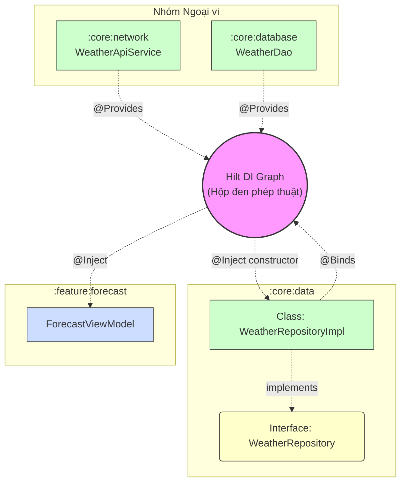

Để tổng hợp lại một cách dễ hình dung nhất, mô hình **Android Architecture hiện đại (Feature-centric kết hợp Core Modules)** giống như việc quy hoạch một thành phố.

Trong đó, các module `:core` là hệ thống cơ sở hạ tầng ngầm (điện, nước, viễn thông), các module `:feature` là những tòa nhà độc lập được xây dựng trên hạ tầng đó, và `:app` là hệ thống giao thông kết nối mọi thứ lại với nhau.

Dưới đây là bức tranh tổng thể và chuẩn mực nhất cho dự án thực tế:

### 1. Cấu trúc 3 Tầng Phân Lớp (The 3-Tier Structure)

Thay vì chia theo Layer ngang (Data/Domain/UI) gây nghẽn cổ chai khi Build code, dự án được chia thành 3 nhóm chính:

* **Tầng 1: `:app` (Lớp Điều phối & Ráp nối)**
* Là module duy nhất sinh ra file `.apk` hoặc `.aab`.
* Nơi khởi tạo Dependency Injection (Hilt/Dagger setup).
* Chứa `NavHost` để định tuyến (Navigation) giữa các Feature.


* **Tầng 2: `:feature:*` (Các Khối Chức năng Cắt dọc)**
* Mỗi module là một tính năng hoàn chỉnh (vd: `:feature:login`, `:feature:home`, `:feature:checkout`).
* Bên trong gói gọn toàn bộ UI (Compose/XML), ViewModel, và cả UseCase đặc thù của riêng màn hình đó.
* **Quy tắc:** Độc lập tuyệt đối. Tính năng này có thể bị xóa đi mà không làm "chết" ứng dụng.


* **Tầng 3: `:core:*` (Hệ thống Nền tảng & Dùng chung)**
* Cung cấp nguyên liệu, dữ liệu và công cụ cho các Feature sử dụng.
* Tuyệt đối không chứa logic hay UI của một màn hình cụ thể nào.


---

### 2. Chi tiết hệ sinh thái `:core` Modules

Đây là xương sống của toàn bộ ứng dụng. Một dự án chuẩn thường có các core module sau:

#### A. Nhóm Core Cốt lõi (Bắt buộc phải có)

* **`:core:model` (Trái tim của App):** Chỉ chứa các Data Class thuần Kotlin (ví dụ: `User`, `Product`). Không có framework Android. Mọi module khác đều phải phụ thuộc vào nó.
* **`:core:designsystem` (Ngôn ngữ Thiết kế):** Chứa Color, Typography, Theme, và các UI component dùng chung (Button, Card, Dialog). Đảm bảo UI đồng nhất toàn app.
* **`:core:data` (Trung tâm Dữ liệu):** Chứa các `Repository` dùng chung. Nó làm nhiệm vụ thu thập data thô từ Network/Database, ánh xạ (map) thành Model sạch và cung cấp cho Feature.

#### B. Nhóm Core Ngoại vi (Xử lý Data Source)

* **`:core:network`:** Cấu hình Ktor/Retrofit, các Interceptor, và định nghĩa API Models (DTO).
* **`:core:database`:** Cấu hình Room/Realm, chứa các DAO và Entities để lưu trữ offline.

#### C. Nhóm Core Wrapper (Cô lập Phần cứng & Bên thứ 3)

* *Mục đích:* Áp dụng Dependency Inversion, không cho Feature gọi thẳng API hệ thống để tránh Vendor Lock-in (bị khóa vào 1 nhà cung cấp).
* **`:core:camera`:** Bọc lại CameraX. Tính năng nào cần chụp ảnh chỉ việc gọi qua module này.
* **`:core:analytics`:** Bọc lại Firebase hoặc Mixpanel.
* **`:core:connectivity`:** Xử lý WiFi Direct, Bluetooth, định vị GPS.

---

### 3. Ba Quy Tắc Vàng (Dependency Rules)

Để kiến trúc này không bị phá vỡ theo thời gian, team dev phải tuân thủ 3 luật lệ sau:

1. **Luồng phụ thuộc một chiều (Top-Down):** `:app` -> `:feature` -> `:core:data` -> `:core:model`. Dữ liệu chảy ngược lại bằng `Flow`.
2. **Các Feature không được "nhìn thấy" nhau:** `:feature:home` tuyệt đối không được `implementation project(':feature:login')`. Điều này chặn đứng hoàn toàn lỗi **MCD (Module Circular Dependency)** và giúp Gradle build cực kỳ nhanh (Cache hit).
3. **Core không biết Feature:** `:core` chỉ cung cấp mỏ neo (Interface) hoặc công cụ chung. Nó không được viết code phục vụ riêng cho một màn hình nào.

## Ví dụ
### (?) ở nhóm B ngoại vi sẽ cấu hình các interface như Service, DAO và impl lại Repository từ data. Sau đó dùng Hilt để inject vào feature đúng không ? Đưa ra luồng cho tôi hình dung dễ hơn
Bạn đã nắm bắt rất đúng tinh thần của Dependency Injection (Hilt), nhưng có một điểm nhỏ trong tư duy sắp xếp module cần được "nắn" lại để chuẩn xác hơn: **Nhóm ngoại vi (`:core:network` và `:core:database`) KHÔNG implement Repository.**

Nhiệm vụ implement Repository thuộc về **`:core:data`**. Các nhóm ngoại vi chỉ đơn thuần cung cấp công cụ (Service, DAO) để `:core:data` sử dụng.

Dưới đây là luồng đi chính xác của dữ liệu và cách Hilt "bơm" (inject) mọi thứ từ dưới lên trên.

### 1. Trách nhiệm thực sự của từng Module

* **`:core:network`**: Chỉ định nghĩa interface API (VD: `WeatherApiService` của Retrofit) và tạo một file Hilt `@Module` để `provide` cái service này. Tuyệt đối không biết Repository là gì.
* **`:core:database`**: Chỉ định nghĩa interface `WeatherDao` và tạo Hilt `@Module` để `provide` DAO.
* **`:core:data`**: Đây mới là "trùm cuối" của data layer. Nó sẽ:
1. Định nghĩa interface `WeatherRepository`.
2. Chứa class `WeatherRepositoryImpl` kế thừa interface trên.
3. Dùng Hilt `@Inject` để kéo `WeatherApiService` và `WeatherDao` vào trong `WeatherRepositoryImpl`.


* **`:feature`**: Chỉ gọi interface `WeatherRepository` thông qua Hilt `@Inject` vào `ViewModel`.

---

### 2. Sơ đồ Luồng Cung cấp (Provide) và Tiêm (Inject) của Hilt

Hãy hình dung luồng hoạt động này giống như một dây chuyền lắp ráp nhà máy. Các mũi tên đứt nét (`-.->`) đại diện cho việc Hilt đang tự động nối các thành phần lại với nhau tại thời điểm biên dịch (Compile time).



---

### 3. Ví dụ Code Thực tế để dễ hình dung

**Bước 1: Tại `:core:network` (Cung cấp Service)**

```kotlin
@Module
@InstallIn(SingletonComponent::class)
object NetworkModule {
    @Provides
    @Singleton
    fun provideWeatherApi(retrofit: Retrofit): WeatherApiService {
        return retrofit.create(WeatherApiService::class.java)
    }
}

```

**Bước 2: Tại `:core:data` (Implement và Bind Repository)**

```kotlin
// 1. Việc tiêm (Inject) Service và DAO vào Impl
class WeatherRepositoryImpl @Inject constructor(
    private val apiService: WeatherApiService, // Hilt tự lấy từ :core:network
    private val weatherDao: WeatherDao           // Hilt tự lấy từ :core:database
) : WeatherRepository {
    override suspend fun getForecast() { ... }
}

// 2. Ép Hilt phải trả về Impl khi có ai đó đòi Interface
@Module
@InstallIn(SingletonComponent::class)
abstract class DataModule {
    @Binds
    abstract fun bindWeatherRepository(
        impl: WeatherRepositoryImpl
    ): WeatherRepository
}

```

**Bước 3: Tại `:feature:forecast` (Sử dụng)**

```kotlin
@HiltViewModel
class ForecastViewModel @Inject constructor(
    // ViewModel chỉ biết đến Interface, hoàn toàn mù mờ về Impl hay Network/Database
    private val repository: WeatherRepository 
) : ViewModel() {
    // ... gọi repository.getForecast()
}

```

Nhờ luồng phân chia này, `:feature` hoàn toàn bị cô lập khỏi các thư viện ngoại vi. Nếu ngày mai dự án quyết định bỏ Retrofit để chuyển sang Ktor, bạn chỉ cần sửa code ở duy nhất module `:core:network`, các module khác (kể cả `:core:data` và `:feature`) đều không bị ảnh hưởng và không cần phải compile lại.

## Now in Android (NIA)
Dự án **Now in Android (NIA)** của Google chính là bản "thánh kinh" thực tế (Reference Implementation) cho mô hình kiến trúc Feature-centric + Core mà chúng ta vừa phân tích. Google đã xây dựng NIA không phải như một tutorial "Hello World", mà là một production-ready app để demo các best practices mới nhất.

Dưới đây là cách Google áp dụng chính xác cấu trúc này vào dự án NIA.

### 1. Sơ đồ cấu trúc thư mục thực tế của NIA

Nếu bạn clone source code của NIA về, bạn sẽ thấy nó được chia các module rất rạch ròi, tuân thủ đúng 3 tầng:

```text
📦 nowinandroid
┣ 📂 app                         <-- Tầng App: File APK, NavHost, Hilt Component tổng
┃
┣ 📂 feature                     <-- Tầng Feature: Các màn hình độc lập
┃ ┣ 📂 bookmarks                 (Màn hình Bookmark bài viết)
┃ ┣ 📂 foryou                    (Màn hình chính "For You")
┃ ┣ 📂 interests                 (Màn hình chọn chủ đề quan tâm)
┃ ┣ 📂 search                    (Màn hình tìm kiếm)
┃ ┗ 📂 settings                  (Màn hình cài đặt)
┃
┣ 📂 core                        <-- Tầng Core: Hạ tầng dùng chung
┃ ┣ 📂 model                     (Chỉ chứa Data Class: Topic, NewsResource, UserData)
┃ ┣ 📂 designsystem              (Màu sắc, Typography, Base Components của Material 3)
┃ ┣ 📂 ui                        (Các UI Component phức tạp dùng model, vd: NewsFeed)
┃ ┣ 📂 data                      (Repositories: NewsRepository, UserDataRepository)
┃ ┣ 📂 database                  (Room: Daos, Entities)
┃ ┣ 📂 network                   (Retrofit: Network Data Sources)
┃ ┣ 📂 datastore                 (Proto DataStore: Lưu preference của user)
┃ ┣ 📂 domain                    (Shared UseCases - Sẽ giải thích kỹ ở dưới)
┃ ┗ 📂 testing                   (Fake Repositories, Test Rules)
┃
┗ 📂 sync                        <-- Module WorkManager chạy ngầm để đồng bộ data

```

---

### 2. Cách NIA giải quyết các bài toán kiến trúc

Google đã áp dụng sự "thực dụng" (pragmatism) rất rõ ràng trong NIA để giải quyết các nhược điểm của Clean Architecture thuần túy:

**A. Chiến lược Offline-First (Ưu tiên ngoại tuyến) tại `:core:data**`
Các Repository (ví dụ `OfflineFirstNewsRepository`) trong NIA không trả về data trực tiếp từ Network.

* Thay vào đó, Repository **luôn luôn** return `Flow` từ `NewsDao` (`:core:database`).
* Việc gọi API (`:core:network`) được giao cho module `:sync` chạy ngầm. Khi có mạng, module `:sync` gọi API, lưu thẳng vào Database. Database thay đổi sẽ tự động phát ra `Flow` mới đẩy lên UI.
* **Lợi ích:** Màn hình luôn có data để hiển thị ngay lập tức (không loading), và kiến trúc luồng dữ liệu cực kỳ sạch (chỉ đi 1 chiều từ DB lên).

**B. Cách NIA sử dụng module `:core:domain` (Rất đặc biệt)**
Trong Clean Architecture, *mọi* tác vụ đều phải qua UseCase. Nhưng NIA thì không.

* Nếu màn hình `:feature:bookmarks` chỉ cần lấy danh sách bookmark, `BookmarksViewModel` sẽ gọi **trực tiếp** `UserDataRepository` từ `:core:data`. Không có UseCase nào được tạo ra để tránh code rườm rà (boilerplate).
* Vậy NIA tạo module `:core:domain` để làm gì? NIA chỉ bỏ vào đây các **UseCase dùng chung cho nhiều tính năng**.
* *Ví dụ:* `GetFollowableTopicsUseCase`. Logic để biết một chủ đề (Topic) có đang được user theo dõi (Follow) hay không cần phải gộp data từ `TopicsRepository` và `UserDataRepository`. Vì cả `:feature:foryou` và `:feature:interests` đều cần logic gộp này, nên NIA tách nó ra thành UseCase đặt ở `:core:domain` để tái sử dụng.


**C. Phân tách UI với `:core:designsystem` và `:core:ui**`
NIA tách UI làm 2 phần để tối ưu khả năng tái sử dụng:

* `:core:designsystem`: Là những viên gạch cơ bản (Màu sắc, Nút bấm chuẩn, Icon). Nó hoàn toàn "mù" về business model. Nó không biết `NewsResource` là gì.
* `:core:ui`: Chứa các Component lớn hơn như thẻ bài viết (`NewsFeedCard`). Thẻ bài viết này dùng nút bấm từ `:designsystem` và cần hiển thị dữ liệu từ `NewsResource` (`:core:model`). Nhờ module này, nhiều màn hình có thể hiển thị danh sách bài viết giống nhau mà không phải copy code.

---

### 3. Luồng đi của dữ liệu (Data Flow) trong NIA

Hãy lấy ví dụ luồng dữ liệu khi người dùng mở màn hình **"For You"** (hiển thị tin tức dựa trên chủ đề user đã chọn).

1. **Hilt khởi tạo:** Tại module `:app`, Hilt tự động kết nối (inject) `NewsDao` (`:core:database`) và `RetrofitNetwork` (`:core:network`) vào `OfflineFirstNewsRepository` (`:core:data`).
2. **UI gọi ViewModel:** `ForYouScreen` (`:feature:foryou`) khởi tạo `ForYouViewModel`.
3. **ViewModel lấy dữ liệu:** `ForYouViewModel` không gọi repository trực tiếp mà gọi `GetUserNewsResourcesUseCase` (nằm ở `:core:domain`). UseCase này sẽ:
* Lấy danh sách Topic ID mà user đang follow từ `UserDataRepository`.
* Dùng danh sách Topic ID đó để query lấy danh sách bài viết tương ứng từ `NewsRepository`.


4. **Xử lý State:** Dữ liệu trả về (là một luồng `Flow<List<NewsResource>>`) được `ForYouViewModel` dùng toán tử `stateIn` để biến thành `StateFlow<ForYouFeedUiState>`.
5. **Render UI:** `ForYouScreen` observe State này, nếu thành công thì lấy các khối giao diện từ `:core:ui` (như `NewsFeed`) để vẽ danh sách bài viết lên màn hình.

**Tổng kết lại:** NIA chứng minh rằng bạn hoàn toàn có thể xây dựng một ứng dụng phức tạp, nhiều màn hình, nhiều background task mà không cần tuân thủ 100% sự giáo điều của Clean Architecture 3 layer ngang. Bằng cách chia dọc theo Feature và rút các thành phần tái sử dụng xuống Core, NIA giữ cho thời gian build cực nhanh, code phân tách rõ ràng (High Cohesion, Low Coupling) và đặc biệt là rất dễ để dev mới đọc hiểu.